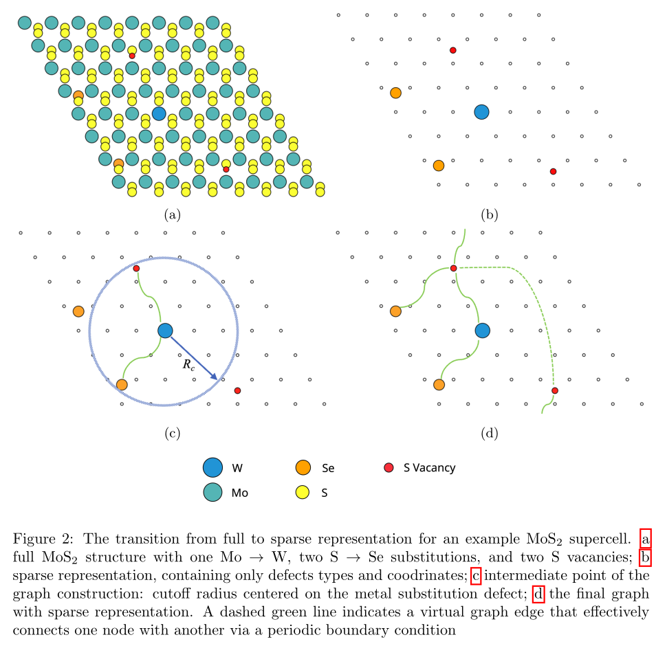

# MEGNetSparse

## Installation

```
pip install MEGNetSparse
```

1) You must first install the torch and [torch_geometric](https://pytorch-geometric.readthedocs.io/en/latest/install/installation.html)
2) The [notebook](examples/example.ipynb) provided in the examples will only work 
with `pymatgen==2023.1.30`, so you may need to reinstall it.

## Try Online
https://constructor.app/platform/public/project/megnet_sparse

## Summary
The library implements MEGNet model for sparse representations of crystals with point defects. The essence of the method is depicted in the figure below:

## Usage

The library consists of two main parts: the first is the construction of a sparse representation of a crystal with point defects, the second is the training of a MEGNet model on this representation.

### Sparse representation construction

```python
convert_to_sparse_representation(
    structure,
    unit_cell,
    supercell_size,
    skip_eos=True,
    skip_was=False,
    skip_state=False,
    copy_unit_cell_properties=False
)
```

- structure : Structure - the structure to convert to
sparse representation
- unit_cell : Structure - unit cell of base material
- supercell_size : List[int] - list with three integers to copy 
a cell along three coordinates
- skip_eos : bool - if True will not add engineered features aka EOS to properties and will speed up 
computations
- skip_was: bool - if True will not add the types of the atoms in the pristine material on the defect sites aka `was` to properties
- skip_state : bool - if True will not add global state, which consists of a vector with the atomic numbers of the atoms present in the pristine material
- copy_unit_cell_properties: bool - if True will also copy unit cell properties
in case of name collisions structure properties will be overwritten

return : Structure - sparse representation of the structure

### Model training
```python
MEGNetTrainer(
    config,
    device,
)
```

- config : dict - template config can be found in examples notebook
- device : str - device in torch format

```python
MEGNetTrainer.prepare_data(
    self,
    train_data,
    train_targets,
    test_data,
    test_targets,
    target_name,
):
```

- train_data : List[Structure] - list of structures in 
sparse or dense representation. The model is agnostic to the representation and won't do the conversion;
if you supply dense structures (aka ordinary `pymatgen.Structure`) the model will be roughly equal to ordinary MEGNet
- train_targets : List[float32] - list of targets
- test_data : List[Structure] - list of structures in 
sparse or dense representation
- test_targets : List[float32] - list of targets
- target_name : str - target name

```python
MEGNetTrainer.train_one_epoch(self)
```

return : mae on train data, mse on train data

```python
MEGNetTrainer.evaluate_on_test(
    self, 
    return_predictions=False
)
```

return : if return_predictions=True, mae on test data, predictions else
 only mae on test data

```python
MEGNetTrainer.predict_structures(
    self, 
    structures_list
)
```

- structures_list : List[Structure] - list of structures in 
the same representation (dense/sparse) as was used for training

return : predictions for structures

```python
MEGNetTrainer.save(self, path)
```

- path : str - where to store model data

```python
MEGNetTrainer.load(self, path)
```

- path : str - where to load model data from
## Citation
Please cite the following paper if you use the library:
```
Kazeev, N., Al-Maeeni, A.R., Romanov, I. et al. Sparse representation for machine learning the properties of defects in 2D materials. npj Comput Mater 9, 113 (2023). https://doi.org/10.1038/s41524-023-01062-z
```
